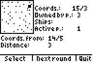
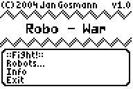
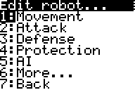
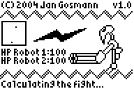
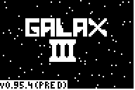
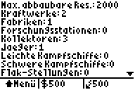
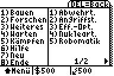
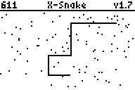

# English Games

## Galax 2

In Galax you collect resources and build different various things with these.
However, there is no goal in this game and I never got around to write the
planned mulitplayer  mode. This makes the whole game a bit boring.

* [galax2.8xp](./galax2.8xp)
* Version 1.64a
* Supports [MirageOS]

## Konquest

This is a clone of of the Linux game with the same name. Starting from a base
planet you send space ships to other planets to conquer them and finally
eliminate your opponent. The game is round based and is played on one TI.
Unfortunately, this wait time between rounds is quite long. Luckily, you can
save the current game state at any time.

Finally, it should be mentioned that there is still one bug I was never able to
locate and fix. This bug was called “Eaten by Error” by a friend of mine and
results in space ships never reaching their target planet. But that might also
be because of space pirates or black holes.

* [konquest.8xp](./konquest.8xp)
* Supports [MirageOS]

## MasterBrain

This is a conversion of the well known game MasterMind. An `X` stands for
a correct digit at the correct position; `>` stands for a correct digit which is
at the wrong position.

* [mbrain.8xp](./mbrain.8xp)
* Version 1.1
* Supports [MirageOS]

## Robowar

Robowar is a game for two players at one calculator. Each player creates their
own robot out of various elements. Afterwards these robots fights against each
other in a virtual arena.

Because this program has many subprograms, I have packed them all in a single
group. The corresponding file has to be copied to the calculator; then you have
to press `[2nd]`, `[Mem (+)]`, `[up]`, `[Enter]`, `[right]`, select the group
“ROBOWAR” and press again `[Enter]` to unpack the group.

* [robowar.8xg](./robowar.8xg)
* Version 1.0
* Supports [MirageOS]

## TI-Battle

TI-Battle is a text-based battle game with the following features:

* 10 Spells
* Character traits (HP, MP, Attack, Defense, Agility, Intelligence)
* AI (OK, I admit that it's to much to say that it is a real AI)
* Player vs player matches
* You can download the character data of another player via the link cable and
  fight against this character which will be controlled by the AI.
* Auto-save
* Player names
* Statistics about wins and loses
* The NPC difficulty can be changed any time
* Plugins

Moreover there is a optional “FairPlay” by player vs player matches, which
balances the disadvantage of the player which is at a lower level.
Unfortunately, this mode is not fully developed.

* [tibattle.8xp](./tibattle.8xp)
* Version 2.2
* Supports [MirageOS]

### TI-Arena

TI-Arena is a plugin for TI-Battle, in which you will fight against enemies
which are getting stronger and stronger until you lose. For this fights you earn
also experience points. If you get enough to advance a level you can do this
when you start TI-Battle the next time. After the last fight the plugin will
show you your score which tells you how well you fought.

* [tiarena.8xp](./tiarena.8xp)
* Version 1.0

### TI-Chara

If you are too lazy to create your own character in TI-Battle you can use this
tool. It provides some predefined characters like fighter, different mages or
paladin.

* [tichara.8xp](./tichara.8xp)
* Version 1.0

### TI-Spells

TI-Spells adds the function for showing which spells you have already learned.
It is also able to show you in a tree diagram in which order spells can be
learned.

* [tispells.8xp](./tispells.8xp) and [Pic9.8xi](./Pic9.8xi) (both required)
* Version 1.0

# German Games/Deutsche Spiele

## Galax 3

Galax 3 ist der Nachfolger von Galax 2 und führt den vermissten Multiplayer ein.
Wie in Galax 2 baut man Rohstoffe ab, um Raumschiffe zu bauen und dann gegen
andere Spieler anzutreten. Allerdings ist das Balancing unausgewogen.

* [gal3pred.8xg](./gal3pred.8xg) (Version 0.95.4 PRE D)
* Hilfe: [gal3help.8xg](./gal3help.8xg) (Version 1.0)
* Benötigt [OmniCalc]
* Unterstützt [MirageOS]

## X-Snake

Man hat eine immer länger werdende Schlange, muss durch zufällig erscheinende
Pixel hindurchsteuern und darf nartürlich nicht sterben.

* [xsnake.8xp](./xsnake.8xp)
* Version 2.0
* Unterstützt [MirageOS]

[MirageOS]: http://www.detachedsolutions.com/
[OmniCalc]: http://www.detachedsolutions.com/

