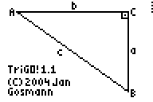
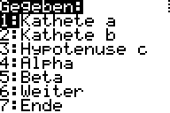
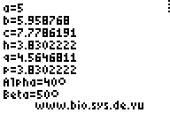

# Mathematics

## BaseConverter

With the BaseConverter you can can convert numbers from one basis to another.
The highest supported basis is 36.

* [basecone.8xp](./basecone.8xp)
* Version 4.1
* Supports [MirageOS]

# German Mathematics Programs/Deutsche Mathematikprogramme

## abc-Formel

Programm zur Auswertung der abc-Formel, welche die Lösung für quadratische
Gleichungen gibt.

* [abcfull.8xp](./abcfull.8xp)
* Version 2.0
* Unterstützt [MirageOS]

## BaseConverter

Mit dem BaseConverter lassen sich Zahlen von einem Zahlensystem in ein anderes
umrechnen. Unterstützt werden alle Zahlensysteme bis zur Basis 36.

* [baseconv.8xp](./baseconv.8xp)
* Version 4.1
* Unterstützt [MirageOS]

## Checker

Der Checker eignet sich zum Überprüfen der Lösungen von Gleichungen oder
Ungleichungen: Man gibt die (Un)Gleichung an, den zu überprüfenden Zahlenraum
und die Schreitweite an und bekommt ausgegeben, welche der geprüften Zahlen beim
Einsetzen eine wahre Aussage ergeben.

* [checker.8xp](./checker.8xp)
* Version 2.0
* Unterstützt [MirageOS]

## Log-Calc

Log-Calc berechnet einen Logarithmus zur einer beliebigen Basis *b*.

* [logcalc.8xp](./logcalc.8xp)
* Version 1.1.
* Unterstützt [MirageOS]

## M-Calc

M-Calc (Measurement-Unit-Calculator) rechnet verschiedene Maßeinheiten in andere
um (z.B. m in cm). “Lowercase” muss mit MirageOS oder Omnicalc aktiviert werden,
da Maßeinheiten, die klein geschrieben werden, auch klein eingetippt werden
müssen.

* [mcalc.8xp](./mcalc.8xp)
* Version 2.0
* Benötigt aktiviertes „lowercase“ (z.B. mit [OmniCalc] oder [MirageOS]
* Unterstützt [MirageOS]

## p/q-Formel

Die p/q-Formel dient zur Lösung quadratischer Gleichungen.. Es gibt 
Zwischenschritte aus und rechnet auch problemlos mit einem Koeffizienten vor
dem x² (z.B.: 3x²+…). Wenn man nur das Ergebnis sehen will, kann man die
Zwischenschritte abschalten, oder, wenn man alles selber rechnen will, sich
einfach nur die Formel ausgeben lassen.

* [pqfull41.8xp](./pqfull41.8xp)
* [pqcomp41.8xp](./pqcomp41.8xp) (verwendet komplexe statt reellen Zahlen)
* Version 4.1
* Unterstützt [MirageOS]

## Phi-Funktion

Die Phi-Funktion berechnet die Anzahl der Zahlen bis zu einer bestimmten anderen
Zahl, deren größter gemeinsamer Teiler 1 ist. Diese Funktion wird unter anderem
in der Kryptographie benötigt.

* [phi.8xp](./phi.8xp)
* Version 2.0
* Unterstützt [MirageOS]

## Prozentrechner

Der Prozent-Rechner rechnet – wie der Name schon sagt – Prozente aus. Das heißt:
Er berechnet Prozentsatz, Prozentwert oder Grundwert aus den beiden restlichen
Werten. Natürlich kann auch der Prozentrechner einfach nur die Formel ausgeben.

* [prozent.8xp](./prozent.8xp)
* Version 2.0
* Unterstützt [MirageOS]

## Scheitel-Calc

Scheitel-Calc zeigt wahlweise mit Zwischenschritten die Berechnung eines
Scheitelpunktes zu einer beliebigen quadratischen Gleichung. Auf Wunsch lässt
sich hierfür auch eine Formel ausgeben.

* [scheitel.8xp](./scheitel.8xp)
* Version 2.0
* Unterstützt [MirageOS]

## TriGO!

TriGO! ist ein Programm für Dreiecksberechnungen. Man gibt die gegebenen Stücke
an und bekommt den Rest ausgegeben. Auf Wunsch werden auch Zwischenschritte
ausgegeben („m. Z“ im Menü). Wegen der enormen Größe (im Vergleich zum Speicher
des TI-83 Plus) gibt es drei Versionen: TriGO! ist die komplette Version mit
allen Funktionen, TriGO! Light fehlen die speziellen Zwischenschritte für
rechtwinklige Dreiecke (rechtwinklige Dreiecke können aber auch berechnet
werden, wenn man für einen Winkel 90° eingibt, allerdings sind die
Zwischenschritte komplizierter und es werden nicht *p*, *q* und *h* ausgegeben)
und TriGO! 90 ist nur für rechtwinklige Dreiecke.

* [trigo.8xp](./trigo.8xp) (komplett)
* [trigoli.8xp](./trigoli.8xp) (light)
* [trigo90.8xp](./trigo90.8xp) (90 Version)
* Version 3.0
* Unterstützt [MirageOS]

[MirageOS]: http://www.detachedsolutions.com/
[OmniCalc]: http://www.detachedsolutions.com/
